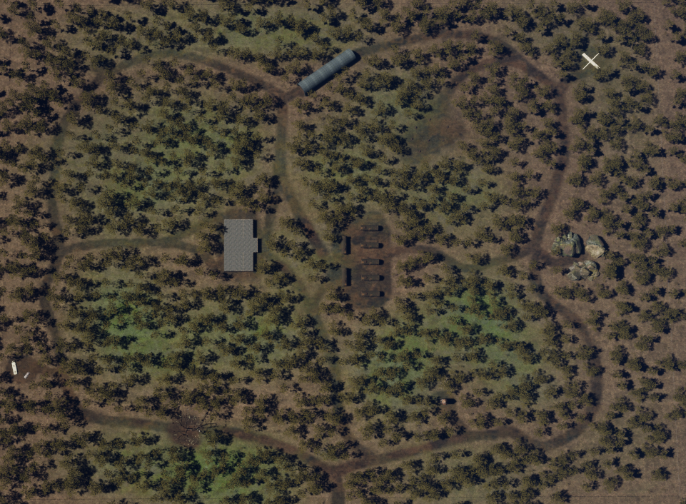
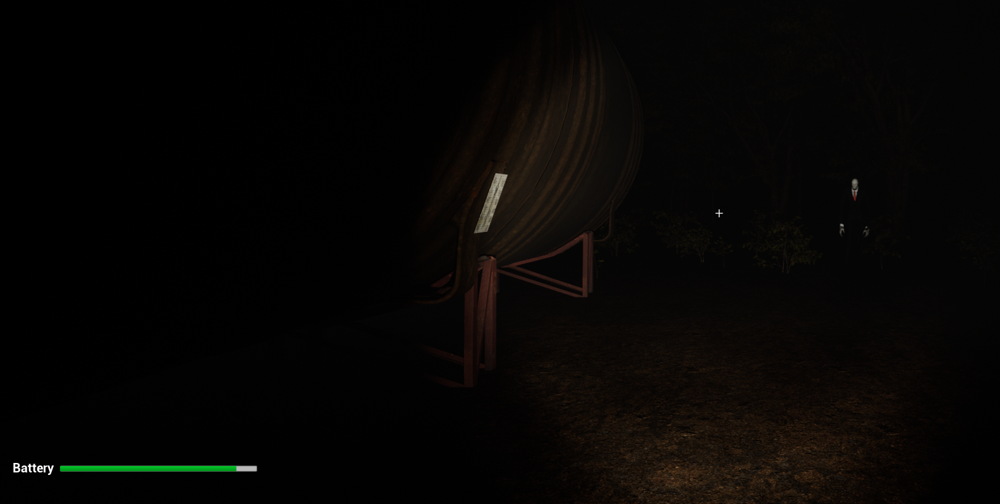
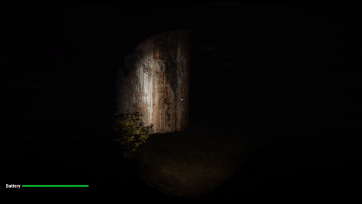

#  Slender: The Eight Pages (UE5 Remake)

## Short Description
 This is a simple survival horror game inspired by "Slender: The Eight Pages" (2012).     
 The player must collect items while avoiding an enemy that teleports around, becoming more aggressive with each item collected.

## Features
* First-person horror experience.
* AI that stalks the player based on proximity.
* Environmental and psychologcal tension build-up.
* Item collection to progress the game.

## Screenshots and Gifs
<!-- 1 GIF, 2 Screenshots -->

## Controls
* **WASD** to move.
* **Space** to jump.
* **E** to interact.
* **F** toggle the Flashlight

## Roadmap
* [ ] Improve AI behavior.
* [ ] Add sound effects and music to enhance the tension.
* [ ] Add battery mechanics for the flashlight.

## Known Issues
* The static effect didn’t work properly after creating the build, as it either didn’t trigger as expected or appeared incorrectly.
* Slender teleport to unable locations and collide.
